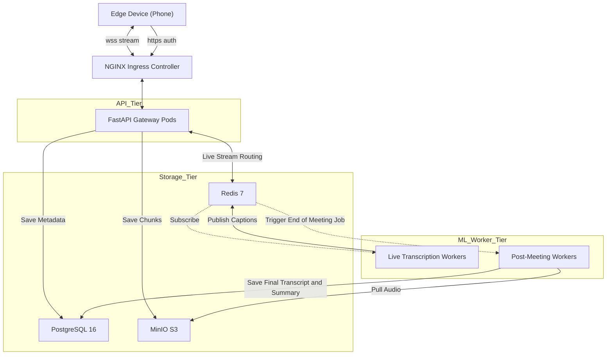
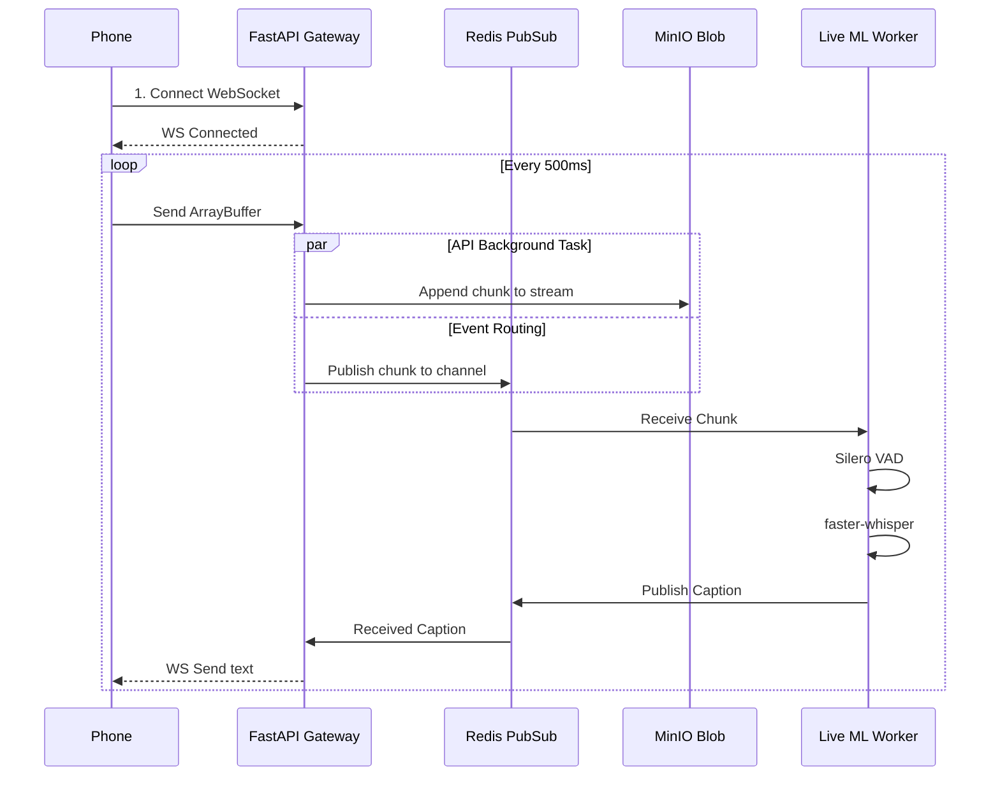
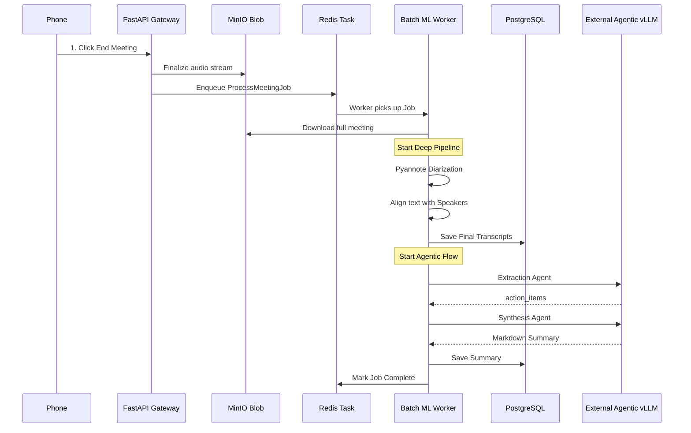

# 🏗️ MeetingScribe AI — Complete System Overview

> **The Big Picture:** A visual dive into the architecture of the Live-First Audio Intelligence Platform. 

This document illustrates how all components—Edge Devices, the FastAPI Gateway, real-time message brokers, and strictly isolated Machine Learning workers—interact to provide a seamless live-captioning and post-meeting summarization experience.

---

## 1. High-Level Topology (Network View)



---

## 2. Request Flow: The Live Stream (Real-Time)

*Focus: Speed (< 500ms latency).*



---

## 3. Request Flow: The Post-Meeting Engine (Deep Polish)

*Focus: Accuracy and Insight (Minutes/Hours).*



---

## 4. Project Directory Structure

How the codebase acts as the physical manifestation of the architecture.

```text
MeetingScribe-AI/
├── services/
│   ├── api-gateway/               # CPU Tier (FastAPI)
│   │   ├── app/
│   │   │   ├── main.py            # Lifespan & Mounts
│   │   │   ├── websockets.py      # Live streaming logic
│   │   │   ├── routers/           # Auth, Meetings, Transcripts
│   │   │   ├── core/              # Config, Security, DB session
│   │   │   ├── models/            # SQLAlchemy (User, Meeting)
│   │   │   └── services/          # S3 Upload, Redis PubSub
│   │   ├── alembic/               # Database migrations
│   │   └── Dockerfile
│   │
│   ├── ml-workers/                # GPU Tier (Python + ARQ)
│   │   ├── live_worker/
│   │   │   ├── subscriber.py      # Listens to Redis
│   │   │   ├── vad.py             # Silero
│   │   │   └── transcriber.py     # faster-whisper streaming
│   │   ├── batch_worker/
│   │   │   ├── tasks.py           # ARQ entrypoints
│   │   │   ├── diarization.py     # Pyannote
│   │   │   └── agents/            # LangGraph (Extractor, Synthesizer)
│   │   └── Dockerfile             # Heavy Nvidia-based image
│   │
│   └── web-client/                # Edge Tier (React or Streamlit V2)
│       ├── UI components
│       └── WebSocket hooks
│
├── charts/                        # Kubernetes Deployments
│   ├── api-gateway/               # standard deployment + HPA
│   ├── ml-workers/                # deployment + KEDA autoscaler
│   ├── postgresql/
│   ├── redis/
│   ├── minio/
│   └── observability/             # Prometheus, Promtail, Jaeger
│
├── terraform/                     # Cloud Provisioning (GKE)
├── docker-compose.yaml            # EVERYTHING running locally
└── Jenkinsfile                    # Build images -> Scan -> Helm Upgrade
```

---

## 5. Exhaustive Tooling & Technology Breakdown

Here is the exact list of tools, libraries, and infrastructure components we will use to build this platform, organized by their role in the architecture.

### 5.1. Core Application Frameworks
*   **FastAPI:** The backend nervous system. Chosen because it natively supports `asyncio` and `WebSockets`, which are absolute requirements for handling thousands of concurrent live audio streams without blocking the CPU.
*   **SQLAlchemy 2.0:** The Object-Relational Mapper (ORM). Used to cleanly map our Python objects (Users, Meetings, Transcripts) to database tables securely and efficiently.
*   **Alembic:** The database migration tool. Whenever we change a database schema (e.g., adding a `language` column), Alembic safely modifies the live database without data loss.

### 5.2. Messaging & Task Queues
*   **Redis 7 (Pub/Sub):** The real-time message bus. Used to instantaneously route incoming live audio chunks from the FastAPI server to the ML Workers, and route the resulting text back to the screen.
*   **arq (Async Redis Queue):** The batch task queue. Lighter and significantly faster than Celery because it is built natively for modern Python `asyncio`. Used to trigger and track the heavy post-meeting processing.

### 5.3. The Machine Learning Stack (Audio)
*   **Silero VAD:** PyTorch-based Voice Activity Detection. Purges all non-human-speech segments (silence, loud room noise) from the audio buffer before it reaches Whisper, drastically reducing GPU load.
*   **faster-whisper (CTranslate2):** The transcription engine. It runs highly-optimized, 8-bit quantized versions of OpenAI's Whisper models, achieving up to 4x faster transcription using half the VRAM.
*   **pyannote.audio:** The Speaker Diarization model. Analyzes the phonetic embeddings of the audio file to identify distinct speakers (Speaker 1, Speaker 2), and separates the audio streams when people talk over each other.
*   **DeepFilterNet:** A real-time audio enhancement neural network. It cleans background noise (HVAC hums, typing, sirens) out of the microphone feed to improve transcription accuracy.

### 5.4. The Machine Learning Stack (NLP & Agentic)
*   **LangGraph:** A framework for building stateful, multi-actor LLM applications. Used to choreograph our specialized "Extractor", "Dynamics", and "Synthesis" agents rather than relying on one massive, failure-prone LLM prompt.
*   **vLLM (or remote LLM endpoint):** The high-throughput LLM server (compatible with OpenAI APIs) that powers the LangGraph agents.

### 5.5. Storage & Databases
*   **PostgreSQL 16:** The primary relational database. Stores the highly structured text output, user identities, and meeting metadata.
*   **MinIO:** Specifically used as an internal Amazon S3-compatible Blob Storage. Because relational databases crash if you put gigabytes of binary audio inside them, MinIO securely hosts the raw `.wav` meeting recordings as flat files.

### 5.6. The MLOps & Infrastructure Backbone (Your Stack)
*   **Kubernetes (GKE):** Orchestrates all the independent microservices (API, Workers, DBs) so they run flawlessly together as one unit.
*   **KEDA (Kubernetes Event-driven Autoscaling):** The platform's secret weapon. Instead of standard scaling based on CPU usage, KEDA looks at the length of our Redis `arq` queue. If there are 10 meeting files waiting to be processed, KEDA dynamically boots 10 separate GPU-enabled ML Worker pods to process them in parallel, then terminates them to save money.
*   **Prometheus & OpenTelemetry:** Automatically tracks deep backend metrics critical to audio processing, such as `transcription_latency_ms` and `vad_dropped_audio_seconds`.

---

## 6. The "Golden Rule" of the Architecture

> **The API Server is Stateless and Stupid.** 

If you view the diagrams above, notice that the FastAPI container does strictly nothing computationally expensive. It intercepts an audio chunk, tosses a copy into S3, and tosses a copy onto a Redis channel. 

This design means if 1,000 users start streaming simultaneously, you can scale the API pods instantly. The heavy ML workers scale entirely independently based on queue backlogs. **This complete decoupling is the defining characteristic of a professional-grade ML platform.**
